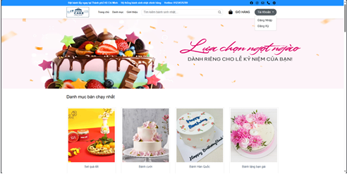
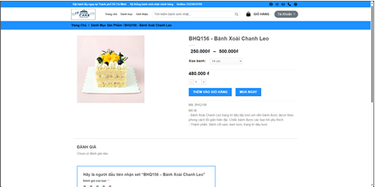
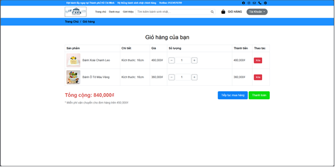

# Birthday Cake Ordering System

A full-stack web application for ordering customizable birthday cakes. This project was developed by a team of three using **Java Servlet**, **JSP**, **MySQL**, and modern frontend tools. It features user authentication, cart management, order processing, and an admin dashboard for managing products and orders.

Example Screenshot:
 
 
 

---

## Features

- User authentication & role-based access (User/Admin)
- Cart management and order checkout
- Cake customization options
- Product listing and category filtering
- Admin dashboard for:
  - Product and category management
  - Order tracking and status updates
- Responsive and interactive UI using JavaScript & AJAX

---

## My Responsibilities

- Developed the **backend** using **Java Servlet** & **JSP** with **MVC architecture**
- Connected to **MySQL** using **JDBC** for data storage and query management
- Implemented user login, registration, and role-based access control
- Built cart functionality, order processing, and cake customization features
- Designed and implemented the **admin dashboard** for managing products and orders
- Improved UX with **AJAX** for dynamic interactions and **Bootstrap** for responsive design

---

## Tech Stack

- Java 
- Servlet
- JSP
- JDBC
- MySQL

---

## Setup & Run Locally

1. **Clone the repository:**

```bash
git clone https://github.com/DoVanMinhTai/Birthday-Cake.git
```
2. ** Import into IDE
- Download TomcatServer and configure to run server
- Run xampp with MySQL and Navicat Premium to control
3. ** Set up MySQL Database
- Create Database (banhsinhnhat3) and import data to table
4. ** Run the project:
Start the Tomcat server


## Document
https://docs.google.com/document/d/1kfVk-QBzbpvpNaklLHugt565zdZp-HvvDxuUkQFIdzY/edit?usp=sharing

## Link repository old:
https://github.com/22130231-NguyenHoangQui/Project-Lap-Trinh-Web
